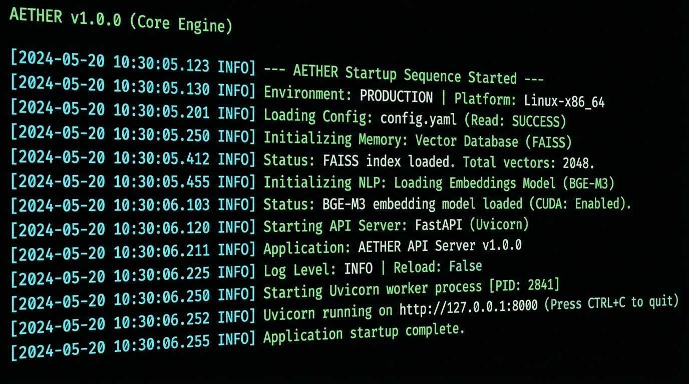

# ⚗️ AETHER

<div align="center">

**Offline · Privacy-First · Multimodal RAG System**

[](https://python.org)
[](https://fastapi.tiangolo.com)
[](https://react.dev)
[](https://github.com/facebookresearch/faiss)
[](LICENSE)

*CPU-primary, air-gapped document intelligence. No cloud. No telemetry. No compromise.*

</div>

---

## ⚡ Run in 5 Minutes

> **Prerequisites:** Python 3.11+, Node.js 18+, Git, ~8 GB free disk space

```bash
# 1. Clone
git clone https://github.com/Mr-strom/AETHER.git
cd AETHER

# 2. Setup (creates venv, installs all dependencies)
setup.bat          # Windows
# — or manually —
python -m venv venv && venv\Scripts\activate
pip install -r requirements-text-only.txt   # lightweight, no GGUF models needed

# 3. Configure
copy .env.example .env

# 4. Launch backend
uvicorn backend.app.main:app --reload --host 0.0.0.0 --port 8000

# 5. Launch frontend (new terminal)
cd frontend && npm install && npm run dev
```

Open **http://localhost:5173** — AETHER auto-ingests demo documents on first boot.

> **Want full LLM inference?** Run `python scripts/setup_models.py` first (~6 GB download of Granite-4.0 + Qwen2.5-3B GGUF weights).

---

## 📸 Terminal Output



---

## 🧠 What is AETHER?

**AETHER** (Adaptive Evidence and Thought Hierarchy for Evidence Retrieval) is a fully offline, CPU-primary multimodal Retrieval-Augmented Generation system for privacy-preserving document analysis and grounded answer synthesis.

| Feature | Detail |
|---|---|
| 🔒 Air-gapped | Zero network calls at inference time |
| 📄 Multimodal ingestion | PDF, DOCX, TXT, MD, CSV, XLSX |
| 🔍 Hybrid retrieval | FAISS (dense) + BM25 (sparse) fusion |
| 🤖 Local LLMs | Granite-4.0 (planner) + Qwen2.5-3B (synthesizer) via llama.cpp |
| 🧬 Embeddings | BGE-M3 (1024-dim), fully local |
| ⚖️ Conflict detection | Cross-source contradiction flagging |
| 📑 Citation validation | Every answer grounded to source chunks |
| 🌐 Full-stack | FastAPI backend + React/Vite frontend |

---

## 🏗️ Architecture

```
 ┌─────────────────────────────────────────────────────────────┐
 │                      AETHER Pipeline                        │
 └─────────────────────────────────────────────────────────────┘

  User Query
      │
      ▼
 ┌──────────┐     Query Plan      ┌─────────────────────────┐
 │ Planner  │ ─────────────────▶ │  Granite-4.0-tiny GGUF  │
 │ (Granite)│                    │  ibm-granite/granite-4.0 │
 └──────────┘                    └─────────────────────────┘
      │
      ▼
 ┌───────────────────────────────────────────────┐
 │               Hybrid Retrieval                │
 │  ┌────────────┐    ┌─────────┐   ┌─────────┐ │
 │  │ BGE-M3     │    │  FAISS  │ + │  BM25   │ │
 │  │ Embeddings │───▶│ Dense   │   │ Sparse  │ │
 │  │ (1024-dim) │    │ Search  │   │ Search  │ │
 │  └────────────┘    └─────────┘   └─────────┘ │
 └───────────────────────────────────────────────┘
      │
      ▼  Evidence Chunks (with conflict detection)
 ┌──────────────┐
 │  Synthesizer │ ──▶  Qwen2.5-3B-Instruct GGUF
 │  (Qwen2.5)  │       grounded answer + citations
 └──────────────┘
      │
      ▼
 ┌──────────────────────┐
 │  Citation Validator  │ ──▶  Final verified answer
 └──────────────────────┘
```

### Ingestion Pipeline

```
Source Files (.txt .md .pdf .docx .csv .xlsx)
      │
      ▼
 IngestRouter  ──▶  TextIngester / PDFIngester / DocxIngester / TableIngester
      │
      ▼
 IngestChunk  ──▶  BGE-M3 EmbeddingService (1024-dim, batch=32)
      │
      ▼
 FAISSIndexService (IndexFlatIP)  +  BM25Index
      │
      ▼
 ./data/index.faiss  +  ./data/index.ids  +  ./data/bm25.pkl
```

---

## 📁 Project Structure

```
AETHER/
├── backend/                    # FastAPI application
│   ├── app/
│   │   ├── main.py             # App entry point, lifespan, CORS
│   │   ├── config.py           # Pydantic settings
│   │   └── logging.py
│   ├── models/                 # SQLAlchemy ORM models
│   │   ├── source.py           # Ingested source documents
│   │   ├── evidence.py         # Evidence chunks
│   │   ├── conversation.py     # Chat conversations
│   │   └── database.py         # Async SQLite engine
│   ├── routers/                # API route handlers
│   │   ├── query.py            # POST /api/query — full RAG pipeline
│   │   ├── sources.py          # CRUD for ingested sources
│   │   ├── conversations.py    # Chat history endpoints
│   │   └── evidence.py         # Evidence chunk retrieval
│   ├── services/
│   │   ├── ingest/             # Document parsers
│   │   │   ├── router.py       # Extension-based routing
│   │   │   ├── text.py         # Sliding-window text chunker
│   │   │   ├── pdf.py          # PyMuPDF + bbox extraction
│   │   │   ├── docx.py         # Heading-aware DOCX parser
│   │   │   └── table.py        # CSV / XLSX → pipe-delimited chunks
│   │   ├── index/              # Vector & keyword indices
│   │   │   ├── embeddings.py   # BGE-M3 wrapper (1024-dim)
│   │   │   ├── faiss_index.py  # IndexFlatIP persist/load
│   │   │   └── bm25_index.py   # rank-bm25 wrapper
│   │   ├── retrieve/           # Retrieval & reasoning
│   │   │   ├── planner.py      # Granite query planning
│   │   │   ├── retriever.py    # Hybrid FAISS+BM25 fusion
│   │   │   ├── synthesizer.py  # Qwen grounded synthesis
│   │   │   ├── conflict_detector.py
│   │   │   └── validator.py
│   │   ├── model_manager.py    # LRU GGUF model loader
│   │   └── attestation.py      # SHA-256 manifest + airgap check
│   └── schemas/                # Pydantic request/response schemas
├── frontend/                   # React + Vite + TypeScript UI
│   └── src/
│       ├── App.tsx             # Main app with routing
│       ├── components/         # UI components
│       ├── api/                # Typed API client
│       └── hooks/              # Custom React hooks
├── scripts/                    # Utility & setup scripts
│   ├── setup_models.py         # Download + verify GGUF weights
│   ├── smoke_test.py           # Memory budget & model load test
│   ├── generate_demo_files.py  # Create demo document bundle
│   └── verify_airgap.py        # Network isolation check
├── docs/screenshots/           # Documentation assets
├── demo_bundle/                # Sample documents (auto-ingested on first boot)
├── .env.example                # Environment template
├── requirements.txt            # Full dependency list
├── requirements-text-only.txt  # Lightweight (no GGUF inference)
├── setup.bat                   # One-shot Windows setup
├── start_aether.bat            # Launch backend + frontend
└── LICENSE                     # MIT License
```

---

## 🚀 Installation

### Prerequisites

| Requirement | Version | Notes |
|---|---|---|
| Python | 3.11+ | 3.13 tested |
| Node.js | 18+ | For frontend |
| Git | Any | |
| RAM | 8 GB+ | 14 GB recommended for full model stack |
| Disk | 8 GB+ | ~6 GB for GGUF model weights |

### Steps

**1. Clone the repository**
```bash
git clone https://github.com/Mr-strom/AETHER.git
cd AETHER
```

**2. Create and activate a virtual environment**
```bash
# Windows
python -m venv venv
venv\Scripts\activate

# Linux / macOS
python3 -m venv venv
source venv/bin/activate
```

**3. Install Python dependencies**
```bash
pip install --upgrade pip

# Lightweight mode (text ingestion + API, no local LLM inference)
pip install -r requirements-text-only.txt

# Full mode (includes llama-cpp-python for local GGUF inference)
pip install -r requirements.txt
```

**4. Configure environment**
```bash
cp .env.example .env   # Linux/macOS
copy .env.example .env # Windows
```

**5. Download model weights** *(full mode only — ~6 GB)*
```bash
python scripts/setup_models.py
```

Downloads to `./models/`:
- `granite-4.0-h-tiny-Q4_K_M.gguf` (~1.5 GB) — Planner & Validator
- `Qwen2.5-3B-Instruct-Q4_K_M.gguf` (~2.6 GB) — Synthesizer
- BGE-M3 + BGE-Reranker (via sentence-transformers HF cache)

---

## 🖥️ Usage

### Quick Launch (Windows)

```bash
start_aether.bat
```

Starts both backend (port 8000) and frontend (port 5173) in separate terminals.

### Manual Launch

**Backend:**
```bash
uvicorn backend.app.main:app --reload --host 0.0.0.0 --port 8000
```

**Frontend** (new terminal):
```bash
cd frontend
npm install
npm run dev
```

| Service | URL |
|---|---|
| Frontend UI | http://localhost:5173 |
| Backend API | http://localhost:8000 |
| API Docs (DEBUG=true) | http://localhost:8000/docs |
| Health Check | http://localhost:8000/api/health |

### Verify Installation

```bash
# Run model smoke test (verifies memory budget + model loading)
python scripts/smoke_test.py

# Generate demo files + test ingestion pipeline
python scripts/generate_demo_files.py
python test_ingestion_manual.py

# End-to-end RAG pipeline test (Planning → Retrieval → Synthesis → Validation)
python test_end_to_end.py

# Verify airgap (no network calls during inference)
python scripts/verify_airgap.py
```

---

## 🧪 Running Tests

```bash
# All tests
pytest

# Specific suites
pytest test_api.py                # API endpoint tests
pytest test_end_to_end.py         # Full RAG pipeline
pytest backend/tests/             # Unit tests
```

---

## ⚙️ Configuration

Key settings in `.env`:

| Variable | Default | Description |
|---|---|---|
| `MODELS_DIR` | `./models` | Path to GGUF model weights |
| `RAM_BUDGET_MB` | `14336` | Memory budget for model loading (MB) |
| `GPU_LAYERS` | `999` | GPU offload layers (0 = CPU-only) |
| `DATABASE_URL` | `sqlite+aiosqlite:///./aether.db` | Async SQLite connection |
| `HOST` | `0.0.0.0` | API server bind address |
| `PORT` | `8000` | API server port |
| `LOG_LEVEL` | `INFO` | Logging verbosity |
| `DEBUG` | `false` | Enables `/docs` and `/redoc` |

---

## 🔬 Model Stack

| Role | Model | Size | Format |
|---|---|---|---|
| Planner & Validator | `ibm-granite/granite-4.0-h-tiny` | ~1.5 GB | GGUF Q4_K_M |
| Synthesizer | `bartowski/Qwen2.5-3B-Instruct` | ~2.6 GB | GGUF Q4_K_M |
| Embeddings | `BAAI/bge-m3` | ~570 MB | HF sentence-transformers |
| Reranker | `BAAI/bge-reranker-base` | ~280 MB | HF sentence-transformers |

All model weights are SHA-256 verified against live Hugging Face LFS object hashes at download time.

---

## 🔒 Privacy & Security

- **Air-gapped inference**: No network calls after model download
- **Local SQLite**: All document data stays on-device
- **SHA-256 attestation**: `manifest.json` records model hashes at load time
- **Airgap verification**: `/api/system/airgap` endpoint confirms no external connections

---

## 📄 License

This project is licensed under the [MIT License](LICENSE).
